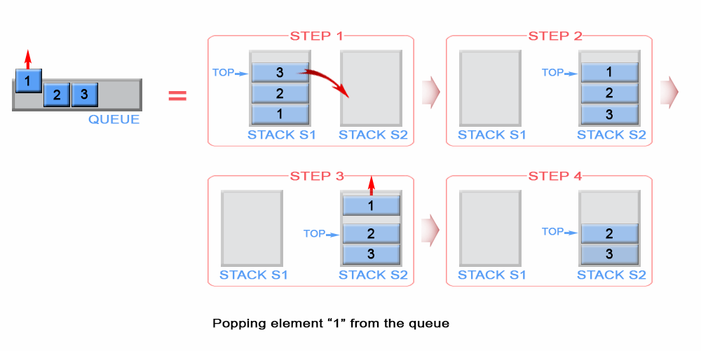

# Implement Queue by Stacks

As the title described, you should only use two stacks to implement a queue's actions.

The queue should support`push(element)`,`pop()`and`top()`where pop is pop the first(a.k.a front) element in the queue.

Both pop and top methods should return the value of first element.

## Example

```
push(1)
pop()     // return 1
push(2)
push(3)
top()     // return 2
pop()     // return 2
```

## Note

全O(1): pop Amortized O(1)

s1收纳所有元素



## Code

```java
public class MyQueue {
    Stack<Integer> s1;
    Stack<Integer> s2;
    public MyQueue() {
        // do intialization if necessary
        s1 = new Stack<>();
        s2 = new Stack<>();
    }

    /*
     * @param element: An integer
     * @return: nothing
     */
    public void push(int element) {
        // write your code here
        s1.push(element);
    }

    /*
     * @return: An integer
     */
    public int pop() {
        // write your code here
        if (!s2.isEmpty()) {
            return s2.pop();
        } else {
            while (!s1.isEmpty()) {
                s2.push(s1.pop());
            }

            return s2.pop();
        }
    }

    /*
     * @return: An integer
     */
    public int top() {
        // write your code here
        if (!s2.isEmpty()) {
            return s2.peek();
        } else {
            while (!s1.isEmpty()) {
                s2.push(s1.pop());
            }

            return s2.peek();
        }
    }

    public boolean empty() {
        return s1.isEmpty() && s2.isEmpty();
    }
}
```
